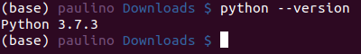
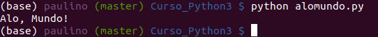
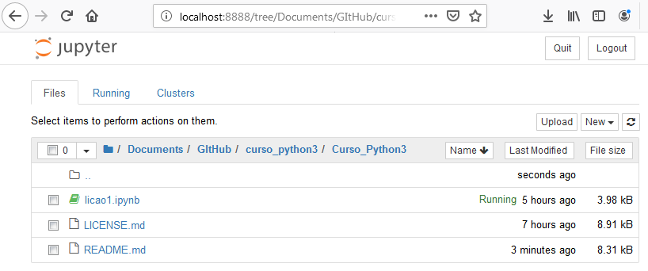

# Curso Introdutório de Python3

A linguagem de programação Python é, atualmente, uma das mais utilizadas no mundo. A maioria das universidades americanas ensinam a programar com ela. Ela tem substituído o Java e o C/C++ na preferência de primeira linguagem de programação.

Isto se justifica pela simplicidade da linguagem. Ela é simples para se aprender e fácil de usar. Não sendo compilada, não há a necessidade de entender o processo de compilação e a diferença entre código fonte e código compilado. Por não ser fortemente tipada, não há a necessidade de pré-declarar as variáveis e seus tipos. Como o professor Thomas Cormen comentou no Quora, o Python é a linguagem preferencial para pequenos programas que não tenham exigências específicas.

É óbvio que a simplicidade vem com um preço. Este é um custo que o programador só sente quando avança para programar alguns tipos de aplicações mais sofisticadas e complexas. Isto não significa que o Python não possa ser usado para programar aplicações complexas, prova disto é que o Python é bastante usado em *Inteligência Artificial*, especificamente, em *Deep Learning* e em análise de dados, *Big Data*.

Neste curso, usaremos um ambiente de programação que deve facilitar o aprendizado, o Jupyter notebook. Para ter acesso a este ambiente, recomendamos a instalação da [Distribuição Anaconda](https://www.anaconda.com/distribution/). Esta é uma distribuição bastante completa de Python com a maioria dos pacotes necessários para a análise de dados e outras aplicações de Python.

Este curso usa o Python3, apesar de existir ainda muita coisa em Python2, a maioria das coisas importantes migraram para o Python3. Futuros desenvolvimentos devem ser feitos na versão 3.

As lições estarão em arquivos de notebook Python que permitem misturar células de texto em *Markdown* com células de código. Este curso é baseado em *exemplos* e *prática*. Isto é, as lições terão textos para explicar os conceitos básicos, exemplos de códigos para serem executados e exercícios que os alunos deverão resolver e testar.

Como sempre acontece com programação, existe mais de uma maneira de resolver um problema, o aluno não deve tentar chegar na solução do instrutor, mas encontrar suas próprias soluções. Entretanto, o estudo do código dos outros pode e deve ser instrutivo. É importante aprender técnicas usadas pelos outros programadores e incorporá-las ao nosso acervo de ferramentas de programação. Os códigos usados neste curso procuram ser didáticos e não usam otimizações que podem ser interessantes para um código a ser usado num sistema de produção. O Professor Donald Knuth nos avisa que 97% das otimizações prematuras produzem códigos com erros. É melhor escrevermos antes códigos claros e compreensíveis para só otimizar depois se necessário.

Guido van Rossum, criador do Python, diz que um dos objetivos na criação do Python é que a linguagem produza códigos fáceis de serem lidos \(em inglês\).

Este curso é fortemente baseado no tutorial online oferecido pela [W3Schools](https://www.w3schools.com/python/), pelo próprio grupo de mantenedores do [Python](https://docs.python.org/3/tutorial/index.html) e nas referências [3] e [4].

## Um Pouco de História

- Python foi criado Guido van Rossum e disponibilizado em 1991.
- Python é multiplataforma, existe para MS Windows, MacOS, Linux e muitos outros.
- Python é usado para:
  + desenvolvimento WEB no lado do servidor;
  + desenvolvimento de software;
  + matemática \(cálculo numérico\) e
  + scripts de sistema, muito usado no Linux e no MacOS.
- Algumas das coisas que podemos fazer com o Python são:
  + Python pode ser usado num servidor para criar uma aplicação WEB;
  + Python pode ser conectado a *SGBD* s (Sistemas de Gerenciamento de Banco de Dados), tanto para a leitura como para a modificação dos dados;
  + Python pode ser usado para manipulação de *Big Data* e para complexos cálculos matemáticos e
  + Python pode ser usado para prototipagem rápida ou para desenvolvimento de software pronto para a produção.
- Python foi criado para legibilidade e tem semelhanças com a língua inglesa com influências da matemática;
- Python usa saltos de linha para terminar uma instrução no lugar do ponto-e-vírgula da maioria das linguagens, ou dos parenteses como em LISP;
- Python baseia-se na identação \(espaço em branco antes de começar o texto numa linha\) com espaços para definir os blocos de códigos de instruções condicionais, malhas de repetição \(loops\), funções e classes. Outras linguagens usam chaves ou palavras chaves marcadoras como *begin* e *end*.

## Instalação do Python

O Python vem pré-instalado em sistemas como o MacOS e linux. Mas, frequentemente, a versão instalada não é a que usaremos. Por exemplo, no MacOS, a versão pré-instalada é a 2. Além disso, frequentemente, estas versões pré-instaladas não são as mais atualizadas e podem apresentar problemas de segurança. Assim, é importante instalar a última versão.

Duas possibilidades devem ser consideradas, a instalaçao oficial a partir do site [Oficial do Python](https://www.python.org/downloads/), ou a [Distribuição Anaconda](https://www.anaconda.com/distribution/). Esta segunda é a que preferimos por já incluir a maioria dos pacotes que podemos desejar para trabalhar com o Python na análise de dados. Seu inconveniente é que muitos dos pacotes incluídos podem não ser necessários. Além disso, ele oferece uma maneira não padrão de gerenciar a instalação dos pacotes e de gerenciar os ambientes virtuais de desenvolvimento de Python.

É importante saber usar a interface da linha de comando \(cli\), vulgo *Prompt do DOS* no MS Windows ou *terminal* no Linux ou MacOS. Para saber a versão do Python, na linha de comando, faça:

```
python --version
```

A execução deste comando deve produzir uma saída mostrando a versão do python instalada conforme mostra a figura:


Isto mostra que o Python está corretamente instalado no seu sistema e que ele é acessível pela interface de linha de comando. Nos sistemas onde as duas versões de Python estão instaladas, no lugar de python, talvez você precise usar *python3* nos comandos. Para completar o teste da instalação, use um editor de texto (notepad, ou de preferência, *notepad++* no caso do MS Windows, gedit ou nano no Linux) e crie um arquivo: alomundo.py com o seguinte conteúdo:

```
print("Alo, Mundo!")
```

  Não use processadores de texto, como o MS Word, para editar o arquivo,
  processadores de texto não criam arquivos de texto puro, eles adicionam
  ao texto escrito comandos de formatação que vão confundir o
  interpretador Python. Além do Jupyter notebook que iremos usar no curso,
  os programas Python podem ser escritos com editores de texto como o notepad++,
  emacs, vi, gedit, atom, brackets ou editores de ambientes de programação, como
  o PyCharm, NetBeans e MS Visual Studio Code.

Salve o arquivo, tomando o cuidado de que a extensão é .py. Em particular, tome cuidado com *MS Windows*, que tem o mal hábito de acrescentar uma extensão .txt, o nome real *errado* do arquivo fica: *alomundo.py.txt* se o arquivo for salvo como arquivo de texto no notepad. Para evitar isto, selecione *Todos tipos* na ficha para Salvar o arquivo. O comando *dir* revela o nome e a extensão verdadeira dos arquivos, o *explorer* \(navegador de pastas do MS Windows\) não mostra extensões conhecidas e, em geral, não mostra o .txt. O que gera muita confusão. O arquivo pode ser executado na linha de comando com:

```
python alomundo.py
```

E deve imprimir uma linha com o texto: **Alo, Mundo!**


### Instalação de pacotes

#### Sem anaconda

O processo normal de instalação de pacotes no Python é usando o comando pip na linha de comando \(em alguns casos, o pip pode não ter sido compilado para o seu sistema e nesse caso você terá de usar *python pip-script*.\).

Para saber quais pacotes estão instalados no seu sistema, faça:

```
pip list
```

Se os pacotes jupyter, ipython e/ou notebook não estiverem instalados, você pode instalá-los com:

```
pip install jupyter ipython notebook
```

No lugar de *install* é possível usar *update* para atualizar estes pacotes se necessário.

#### Com Anaconda (ou miniconda)

Na distribuição Anaconda do Python, o programa *conda* gerencia os pacotes e os ambientes isolados de programação. Para instalar ou atualizar os pacotes simplesmente use *conda* no lugar de *pip*.

Exemplo

```
conda install jupyter ipython notebook
```

Isto não deve ser necessário se você instalou o Anaconda, mas pode ser necessário se você tiver criado um ambiente mínimo ou instalado o miniconda.
Não se recomenda usa o pip na instalação do Anaconda, mas isto pode ser necessário para pacotes não disponíveis no repositório Conda.

Para saber quais pacotes estão instalados, use na linha de comando:
```
conda list
```

## Arquivos .ipynb

Os arquivos notebook de Python têm extensão .ipynb. É neles que estão as lições deste curso.

Os arquivos de notebook do Python são compostos por células. Estas células podem ter texto em formato *Markdown*, como neste arquivo README.md ou código Python. Para usar estes arquivos, execute o programa *notebook-jupyter* que deve ter sido instalado com o Anaconda. Ele vai iniciar um servidor com o interpretador e conectar o seu navegador preferido ao servidor.


Para começar um interpretador \(*kernel*\) para executar os códigos de um arquivo notebook, como o *licao1.ipynb* da figura, basta clicar no *link* do arquivo na página do *notebook*.


Aí, você pode executar cada célula  de código ou executar todas as células de uma vez \(pelo menu Run\).

1. [Lição 1](licao1.ipynb): Introdução ao sistema, ao jupyter-notebook e às variáveis em Python3.

2. [Lição 2](licao2.ipynb): Tipos de dados e operadores no Python.

3. [Lição 3](licao3.ipynb): Controle de fluxo de instruções.

### Referências

1. [Python Tutorial W3Schools](https://www.w3schools.com/python/), https://www.w3schools.com/python/, acesso em 16/06/2019.

2. [Python Tutorial](https://docs.python.org/3/tutorial/index.html), acesso em 01/08/2019.

3. Jamie CHAN, Learn Python in one day and Learn It Well, Learn Coding Fast, 2014. #3

4. Tariq RASHID, Make Your Own Neural Network, 2014. #4
