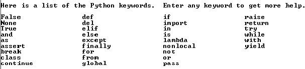

# Identificadores em Linguagens de Programação

Identificadores são usados em linguagens de programação para dar nome a
variáveis, constantes, funções, procedimentos, classes, métodos, módulos,
pacotes, objetos, ... Cada linguagem de programação tem suas regras para
a formação de identificadores. Em geral, tem-se algo do tipo:

  Um identificador começa com uma letra ou um \_ e é seguida de letras,
  dígitos e \_.

Dependendo da linguagem, tem-se limitação da quantidade de caracteres, uso
ou não de caracteres especiais como \$, -, pontuação, ^, %, \>, <, ...
As linguagens podem diferenciar entre maiúsculas e minúsculas, ou não
(nesse caso diremos que a linguagem é insensível à caixa).

  Em nenhuma linguagem é permitido colocar um espaço no identiificador.
  Dois nomes com um espaço entre eles são dois identificadores.

## Identificadores no Python 3

O Python é sensível à caixa, os caracteres válidos são letras, dígitos e \_.
O identificador não pode começar com um dígito. Uma norma do *PEP-8* estabelece
que uma linha de código não deve ter mais do que 79 caracteres, em consequência,
o identificador deve ter menos de 79 caracteres.

### Palavras-Chaves do Python 3

A figura abaixo mostra as palavras-chaves do Python 3.6.8.

Palavras-Chaves não podem ser usadas como identificadores pelos programadores
Python. Elas têm significado especial e não podem ser usadas como nomes de
variáveis, módulos, funções, ...

Além das regras restritivas de quais caracteres e nomes podem ser usados,
existem convenções que dizem como os nomes são escolhidos, escritos, etc.
É comum se recomendar a não começar as variáveis dos programadores de
aplicações com \_\_, pois muitas vezes, é assim que começam nomes do sistema.
Para nomes privados, comece o nome com \_. Esta convenção permite identificar
facilmente nomes cuja insteção é de serem privados. Não comece e termine
um identificador com \_, tipos internos do Python usam nomes desta forma.

### Notação Camelo

Programadores de C/C++ ao usar identificadores compostos por mais de um nome
costumam colocar um \_ entre cada nome. Assim um identificador válido é:
cor_de_carro. Os programadores de Java costumam usar o que se convencionou
chamar de notação camelo. Nela os nomes começam com a primeira letra em
maiúsculo: corDeCarro.

Uma outra convenção do Java é começar os identificadores de classes com uma
letra maiúscula: Object.

Convenções da engenharia de Software costumam recomendar que nomes de classes
sejam substantivos e nomes de métodos sejam verbos. Nomes de interfaces são,
geralmente, adjetivos.

O Python não define uma convenção para a notação a ser adotada. As empresas e
os próprios programadores são livres para usar suas convenções. Lembre-se,
entretanto, que um dos objetivos na criação do Python é de que os programas
sejam legíveis. Escolha o nomes das variáveis, funções, classes, etc de modo
que o programa seja fácil de ser lido e compreendido.
